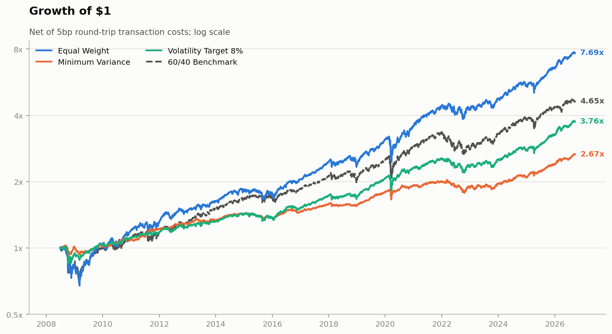
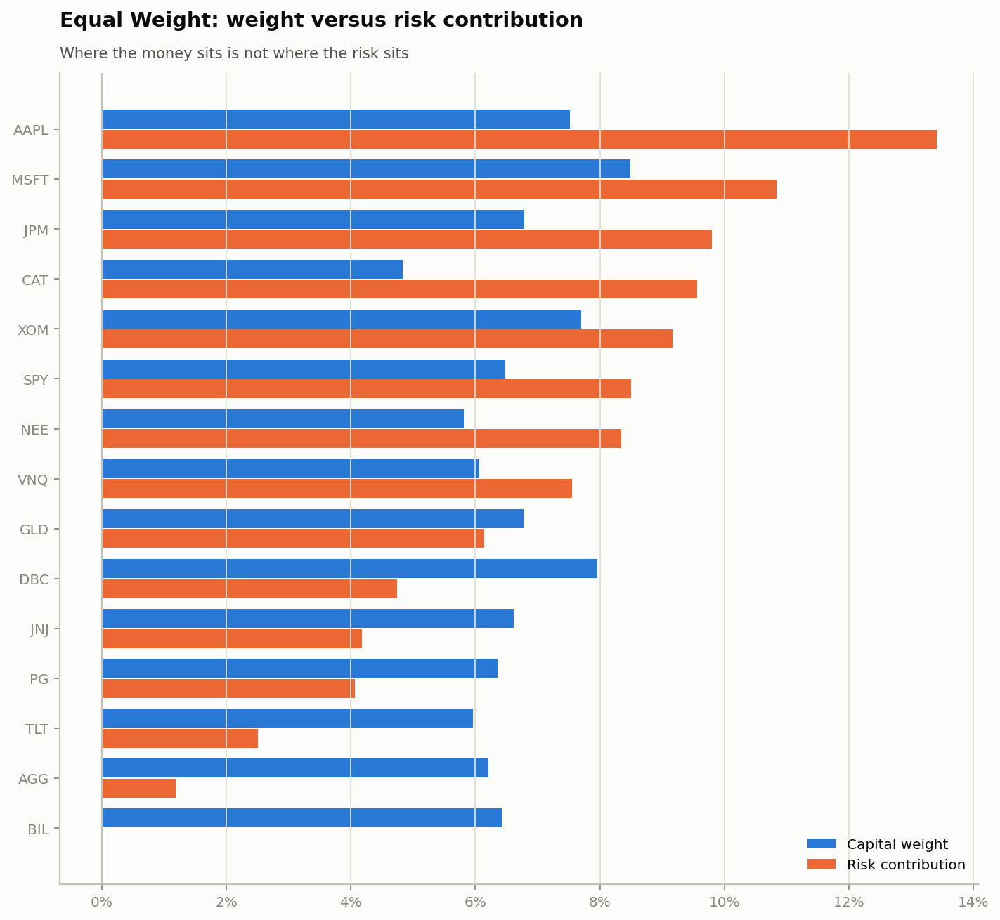
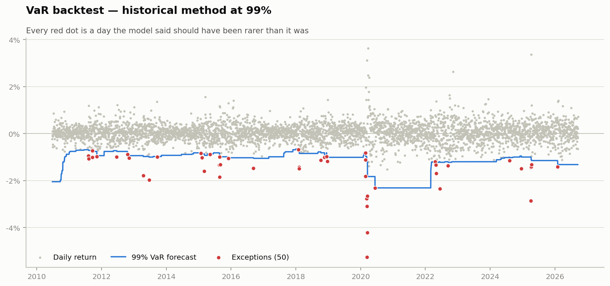
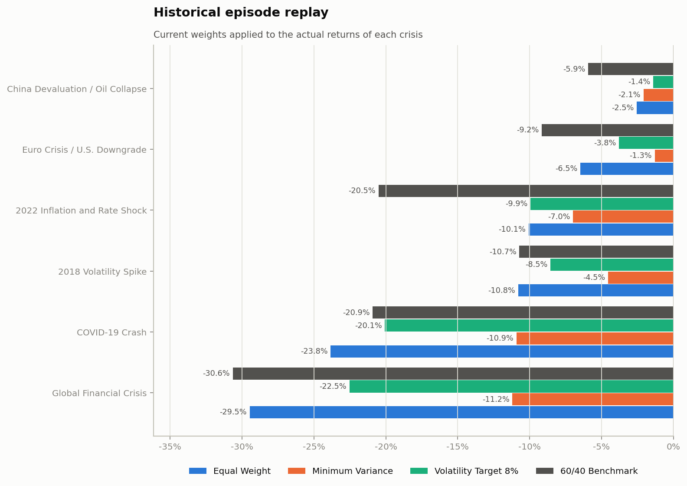
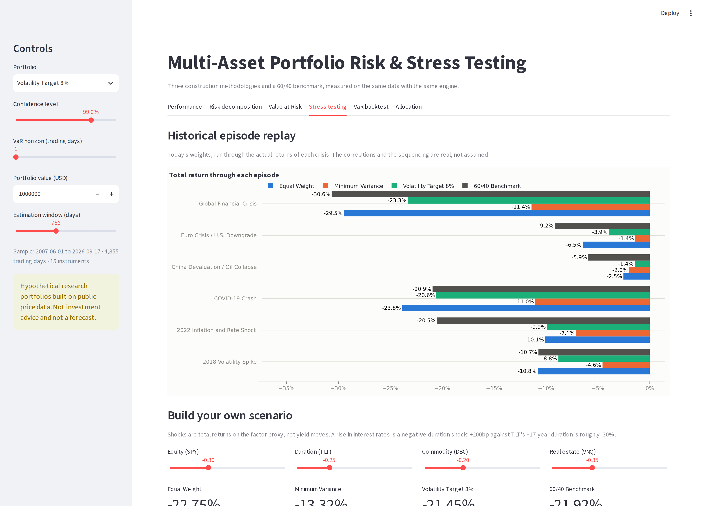

# Multi-Asset Portfolio Risk and Stress-Testing Framework

A Python framework for constructing multi-asset portfolios and measuring their market risk
under normal and stressed conditions — volatility, beta, drawdown, Value at Risk by three
independent methods, expected shortfall, Monte Carlo simulation, historical and hypothetical
stress scenarios, and a full statistical backtest of the VaR models themselves.

> **Disclaimer.** Every portfolio here is a *hypothetical research construct* built from
> publicly available price data. Nothing in this repository represents a real client account,
> real assets under management, investment advice, or a forecast. Stress scenarios are
> analytical assumptions chosen to probe the portfolios, not predictions about markets.

---

## The question

**How does portfolio construction affect return, volatility, drawdown and downside risk under
normal and stressed market conditions — and do the standard risk models hold up when tested?**

Three portfolios are built from one universe of 15 instruments over **4,855 trading days
(June 2007 – September 2026)**, rebalanced quarterly and net of costs, against a static 60/40
benchmark. The construction rules are ordered by how much estimation they require, so the
assumption-free equal-weight portfolio acts as a control.



## Headline results

| Portfolio | Ann. return | Ann. vol | Sharpe | Sortino | Max DD | Beta | 1d 99% VaR | 1d 99% ES |
|---|---:|---:|---:|---:|---:|---:|---:|---:|
| Equal Weight | 11.87% | 13.08% | **0.82** | 1.18 | −33.4% | 0.62 | 2.45% | 3.51% |
| Minimum Variance | 5.55% | 5.10% | **0.83** | 1.18 | −12.9% | 0.11 | 0.85% | 1.22% |
| Volatility Target 8% | 7.55% | 7.41% | **0.84** | 1.19 | −15.7% | 0.30 | 1.22% | 1.97% |
| 60/40 Benchmark | 8.82% | 11.83% | 0.66 | 0.94 | −29.8% | 0.59 | 2.23% | 3.21% |

### Five findings

**1. Construction relocated risk; it did not create return.** All three research portfolios
landed within 0.02 of each other on Sharpe (0.82–0.84), across a 2.6× spread in volatility. Each beat the
60/40 benchmark by roughly a quarter. Choosing between them is choosing a risk level, not
buying skill.

**2. Capital weights are not risk weights.** In the equal-weighted portfolio the equity
sleeve holds 54% of the capital and produces 69% of the volatility, while fixed income holds
12% and produces 3.7%. At the asset level, contributions run from 13.4% down to effectively
zero for the cash proxy.



**3. Parametric-normal VaR is rejected at 99% for every portfolio.** It breaches roughly
twice as often as it promises — 78 exceptions against 40.8 expected for the equal-weighted
portfolio, Kupiec p < 0.001. Excess kurtosis runs 10–19 across the portfolios; under a normal
distribution, the equal-weight portfolio's worst day is an event that should occur once in
the age of the universe. It occurred in March 2020.

**4. Every VaR method fails the independence test.** Exceptions cluster in 2020 and 2022,
because none of the four methods models volatility clustering. The chart below shows the
failure directly: the forecast is a step function that jumps *after* the crisis, not before.



**5. Reducing one risk substitutes another.** The minimum-variance portfolio's worst drawdown
was not the GFC — it was **2022** (−12.9%, 395 days to recover). By retreating into bonds and
cash it sidestepped equity crises and concentrated into duration, which is what the rate
shock attacked.



---

## What's in here

```
portfolio-risk-framework/
├── config/config.yaml          # every modelling assumption, in one documented file
├── src/prisk/
│   ├── config.py               # typed accessor over the config
│   ├── data.py                 # download, cache, calendar alignment, quality report
│   ├── portfolios.py           # 3 construction rules + no-look-ahead rebalancing engine
│   ├── metrics.py              # return, vol, beta, Sharpe, Sortino, drawdown, risk contribution
│   ├── risk.py                 # historical / parametric / Monte Carlo VaR, ES, component VaR
│   ├── stress.py               # episode replay, factor shocks, correlation stress
│   ├── backtest.py             # Kupiec, Christoffersen, Basel traffic light
│   ├── plots.py                # 12 chart functions on one validated palette
│   └── pipeline.py             # rebuilds every table and figure from scratch
├── notebooks/                  # 3 executed analysis notebooks (39 charts, outputs included)
├── dashboard/app.py            # interactive Streamlit dashboard
├── reports/investment_risk_memo.md   # two-page investment-risk memo
├── docs/methodology.md         # full methodology and known limitations
├── outputs/tables/             # 41 CSVs — every figure's underlying data
├── outputs/figures/            # 30 publication-quality charts
├── tests/                      # 119 tests, including explicit no-look-ahead checks
└── data/raw/prices_snapshot.csv  # versioned price snapshot for exact reproducibility
```

## Quick start

```bash
git clone https://github.com/<your-username>/portfolio-risk-framework.git
cd portfolio-risk-framework
pip install -r requirements.txt

# Rebuild every table and figure (~50 seconds, fully offline from the shipped snapshot)
PYTHONPATH=src python -m prisk.pipeline

# Interactive dashboard
PYTHONPATH=src streamlit run dashboard/app.py

# Tests
PYTHONPATH=src pytest tests -q

# Refresh prices from Yahoo Finance and extend the sample
PYTHONPATH=src python -m prisk.pipeline fetch --force
```

The repository ships a snapshot of the price panel, so a fresh clone reproduces every number
above **exactly and without network access**.

## Interactive dashboard

Change the confidence level, the horizon, the estimation window or the stress assumptions and
watch the numbers move — the point being that a risk number is the output of a set of
choices, not a fact.



Six panels: performance, risk decomposition, Value at Risk, stress testing (with a
build-your-own-scenario control), VaR backtest, and allocation through time.

## Notebooks

| Notebook | Covers |
|---|---|
| [01 — Data and Portfolio Construction](notebooks/01_data_and_portfolio_construction.ipynb) | Provenance, cleaning, correlation stability, covariance shrinkage, the three rules, performance, drawdown anatomy, turnover |
| [02 — Risk Measurement, VaR and ES](notebooks/02_risk_metrics_and_var.ipynb) | Rolling beta, risk contribution, distribution shape, three VaR methods and why they disagree, expected shortfall, component VaR |
| [03 — Stress Testing and Backtesting](notebooks/03_stress_testing_and_backtesting.ipynb) | Episode replay, factor betas, hypothetical scenarios, correlation stress, Kupiec / Christoffersen / Basel |

All three are committed with their outputs, so they render on GitHub without being run.

## Methodology in brief

**Universe (15 instruments).** Eight sector-spread equities (AAPL, MSFT, JNJ, JPM, XOM, PG,
CAT, NEE), broad equity (SPY), fixed income (AGG, TLT), commodities (DBC, GLD), REITs (VNQ),
cash (BIL). Split- and dividend-adjusted daily closes from Yahoo Finance.

**Portfolios.** Equal weight (estimates nothing); long-only minimum variance with a 25%
position cap, solved by CVXPY with a SciPy fallback on a Ledoit-Wolf shrunk covariance
matrix; and an 8% volatility target applied to an equal-risk-contribution growth sleeve with
no leverage. Benchmark: static 60/40 SPY/AGG. Quarterly rebalancing, 5bp round-trip costs.

**No look-ahead, enforced.** Weights applied from date *t* use only data up to *t*. A unit
test corrupts the tail of the return panel by a factor of ten and asserts that earlier
weights are unchanged. The same discipline and the same kind of test apply to the rolling VaR
forecasts.

**VaR.** Historical (empirical quantile), parametric (normal, fitted Student-t, and
Cornish-Fisher), and Monte Carlo (100,000 paths from a multivariate Student-t built as a
normal-variance mixture, so assets crash together). All methods see the same sample, reported
for both the full history and the trailing window.

**Stress.** Six historical episodes replayed at current weights with drifting weights, plus
six hypothetical factor-shock scenarios propagated through multivariate regression betas, plus
a correlation stress that holds volatilities fixed and forces pairwise correlations upward.

Full detail, including every known limitation: **[docs/methodology.md](docs/methodology.md)**.

## Things this project gets right that are easy to get wrong

- **Look-ahead bias** is tested for, in both the rebalancing engine and the VaR backtest, not
  just avoided by intention.
- **The Student-t VaR uses the fitted scale**, not the sample standard deviation on top of a
  low-ν quantile. The naive version breached 11% of the time at 95% confidence.
- **Cornish-Fisher is computed and then rejected** for this data, with the reason stated,
  rather than quietly dropped because it gave an inconvenient answer.
- **Basel traffic-light zones are suppressed at 95%**, where they are not defined and would
  label every correctly calibrated model red.
- **Capture ratios use mean returns**, not compounded sub-samples, which overflow into
  meaninglessness over thousands of non-consecutive days.
- **Drawdown floors the running peak at initial capital**, so a loss on day one is not
  silently rebased away.
- **Every method in the VaR comparison sees the same sample**, so the table measures the
  method rather than the window.
- **Covariance shrinkage is applied to the correlation matrix**, not the covariance matrix.
  Shrinking the covariance directly pulled the cash proxy's reported volatility from 0.2% to
  4.8% — twenty times its true value — and fed that to the optimiser.

## Limitations

No conditional volatility model (GARCH/EWMA) — this is the largest gap and it is what every
failed independence test points at. The universe is survivorship-biased and chosen with
hindsight. Costs are a flat 5bp with no market-impact modelling. Stress betas are estimated
in calm conditions and applied to stressed ones. The sample contains one rate-shock regime.
See [docs/methodology.md](docs/methodology.md#7-known-limitations) for the full list.

## Built with

Python 3.10+ · pandas · NumPy · SciPy · scikit-learn (Ledoit-Wolf) · CVXPY · Matplotlib ·
Seaborn · Streamlit · Plotly · pytest
